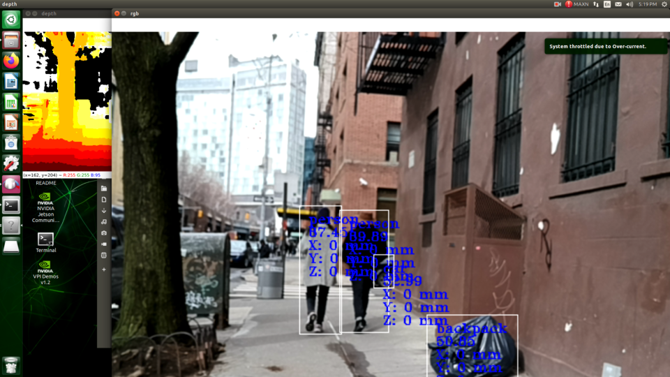

# Blind-Navigation-Assistance

## Abstract 
The purpose of this project is to develop a system that assists the visually impaired while walking in urban environments with audio signals and cues. The product will be a wide strap that goes around the user’s upper torso. Attached to this strap will be a camera facing forward, an Nvidia Jetson Nano to the left of it, and a battery pack for the system to the left of the camera. While the user is walking, the camera will capture a feed of its surroundings; the feed will then be processed by an object detection algorithm trained on YoloV7. The system detects any object that may obstruct the user’s path such as  humans, cars, bicycles, construction equipment, and any other object that is part of the MS COCO library. In the case of moving objects such as humans, cars or bicycles, an audio (via speakers or headphones) warning cue will be issued to the user. The audio will be in the format of a “beep” sound that changes pitch according to the distance and direction of the object.

# Hardware
- Nvidia Jetson Nano
- Luxonis Oak-D Camera
- Battery Pack

## Notes
 
Rubberband Installation: add the FOLDER path to the environment variables, not the exe